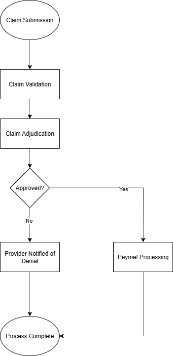

# Healthcare Claims Analysis  

This project demonstrates how a Business Analyst approaches the optimization of healthcare claims processing. It showcases real-world BA deliverables — from requirements gathering to SQL analysis and dashboard reporting — in the insurance and healthcare domain.  

---

## Project Overview  
The healthcare claims process often suffers from high denial rates, long processing cycles, and limited transparency for stakeholders. This project simulates a case study where I:  
- Documented **business requirements** and **user stories** for claims optimization  
- Designed a **process workflow** to highlight adjudication paths  
- Wrote **SQL queries** to analyze denial reasons, cycle times, and provider performance  
- Created a **Power BI dashboard** (mocked with sample data) to present KPIs to leadership  

The objective is to show end-to-end Business Analyst skills in documentation, data analysis, and visualization.  

---

## Deliverables  
- [Business Requirements](BusinessRequirements.md) – BRD with objectives, scope, and success metrics  
- [User Stories](UserStories.md) – Agile stories with acceptance criteria  
- [Data Dictionary](DataDictionary.md) – Definitions, data types, and business meaning of claims data  
- [SQL Queries](SQLQueries.sql) – Queries with business context and insights  
- [Process Flow Diagram](ProcessFlow.png) – Visual representation of claim submission to payment  
- [Power BI Dashboard](PowerBI-Dashboard.pdf) – KPIs and trends for claims management (sample visualization)  

---

## Process Flow  
  

---

##  Key Insights (From Analysis)  
- ~22% of claims were denied; ~40% of denials were preventable (invalid coding, missing info)  
- Average claim cycle time reduced from **14–18 days → 10–12 days** with proposed process improvements  
- Top 5 denial reasons accounted for 70% of rejections — addressing these can improve accuracy by **15–20%**  
- Provider-level performance analysis revealed high variation in approval rates across regions  

---

##  Tools & Skills Demonstrated  
- **Business Analysis** → Requirements gathering, user stories, workflows  
- **SQL** → Queries for claims validation, denial trends, provider KPIs  
- **Power BI** → KPI dashboards for decision support  
- **Agile Scrum** → Documentation and acceptance criteria  

---

## About Me  
I’m a Business Analyst with 4+ years of experience in **insurance, healthcare, and financial services**. Skilled in requirements gathering, SQL, data visualization, and process optimization. This project reflects how I approach turning **business complexity into clarity and measurable results**.  
